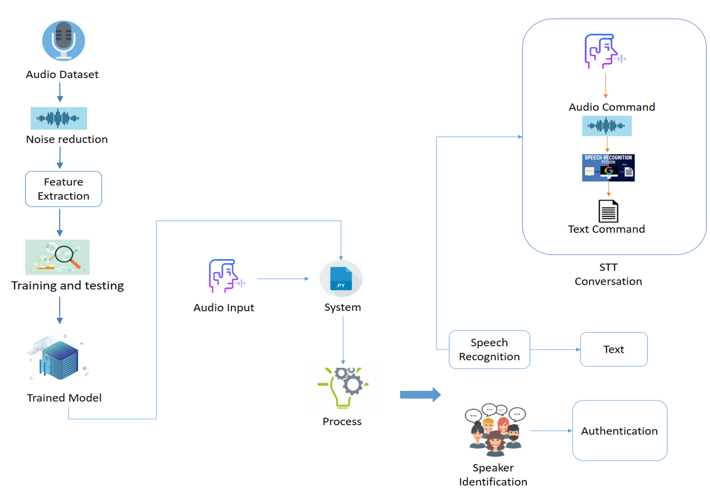

#Speaker Recognition

This purpose of this project is to identify the people by their audio and recognize authonticity. 
For the implementation i used CNN and for feature extraction i used MFCC and spectrogram.
I used my own dataset to train the model. There is a 10 presons' audio and 10 sample of individual.
I got 78 % validation accuracy.Moreover i also worked on a opensource dataset called TIMIT courpus and i got 82% accuracy on that.
In this system there a speech_recognition library is also used for the speech to text conversion to identify a command.

Work Flow Diagram:
-------------

    "# Speaker_Recognition" 
